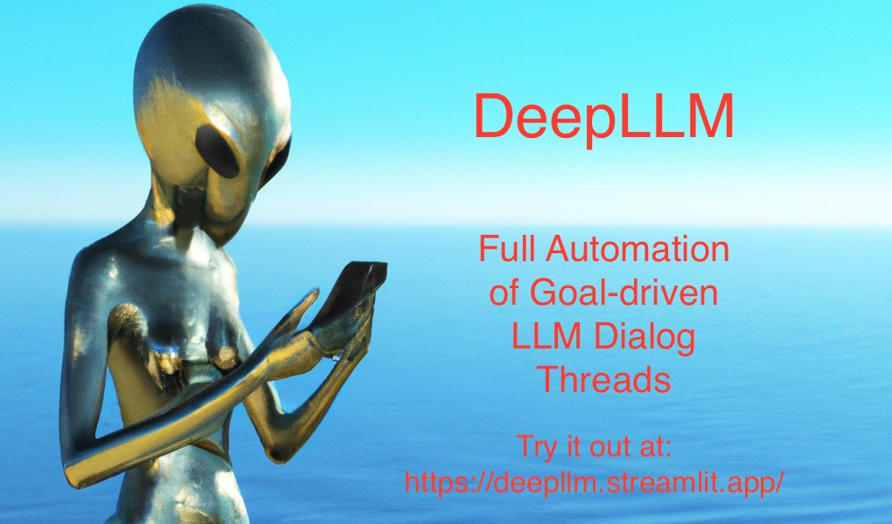

# deepllm: Full Automation of Goal-driven LLM Dialog Threads with And-Or Recursors and Refiner Oracles



### Overview

We automate deep step-by step reasoning in an LLM dialog thread by recursively exploring alternatives (OR-nodes) and
expanding details (AND-nodes) up to a given depth. Starting from a single succinct task-specific initiator we steer the
automated dialog thread to stay focussed on the task by synthesizing a prompt that summarizes the depth-first steps
taken so far.

Our algorithm is derived from a simple recursive descent implementation of a Horn Clause interpreter, except that we accommodate our logic engine to fit the natural language reasoning patterns LLMs have been trained on. Semantic similarity to ground-truth facts or oracle advice from another LLM instance is used  to restrict the search space and validate the traces of justification steps returned as answers. At the end, the unique minimal model of a generated Horn Clause program collects the results of the reasoning process.

As applications, we sketch implementations of consequence predictions, causal explanations, recommendation systems and
topic-focussed exploration of scientific literature.

### INSTALLATION and USAGE:

#### First, you will need to acquire your OpenAI key from [here](https://openai.com/).

#### *NEW:* with it, you are ready to try out at: https://deepllm.streamlit.app/

#### NEW: an intro on how to use the app and the API is now on [Youtube](https://www.youtube.com/watch?v=41MgPX44szs&ab_channel=PaulTarau)

To run the code locally, put the OpenAI key in your Linux or OS X shell environment with:

```
export OPENAI_KEY=<your_key>
```

#### Downloading

Clone from github with with:

```
git clone git@github.com:ptarau/recursors.git
```

#### Installing

If you have cloned this repo, you can install the package ```deepllm``` by typing in folder ```recursors```

```
pip3 install -e .
```

You can also install it from [pypi](https://pypi.org/search/?q=deepllm) with

```
pip3 install deepllm
```

#### API

The DeepLLM [API](https://github.com/ptarau/recursors/blob/main/deepllm/api.py) exposes its high-level functions ready
to embed in your application with something as simple as (assuming the your OPENAI_KEY is exported by your environment):

```
for result in run_recursor(initiator='Using tactical nukes', prompter=conseq_prompter, lim=2):
    print(result)
```

Also, you can explore questions with less gruesome results like in:

```
for result in run_rater(initiator='Artificial General Intelligence', prompter=sci_prompter, lim=2, threshold=0.5):
    print(result)
```

#### Tests and demos

* Take a look at folder [deepllm/tests](https://github.com/ptarau/recursors/tree/main/deepllm/tests) for typical uses.

* There are more extensive demos in
  folder  [deepllm/demos](https://github.com/ptarau/recursors/tree/main/deepllm/demos) .

* There is [a ```streamlit``` app]( https://github.com/ptarau/recursors/tree/main/deepllm/apps) showing typical
  use cases, also deployed on the cloud at https://deepllm.streamlit.app/ .

* If you install  [fastchat](https://github.com/lm-sys/FastChat), there are examples of using Vicuna models with it in
  folder [deepllm/local_llms](https://github.com/ptarau/recursors/tree/main/deepllm/local_llms).

#### Streamlit web app

After installing streamlit, try it with:

```
streamlit run deepllm/apps/app.py
```

#### Paper describing this work

If you find this software useful please cite it as:

```
@ARTICLE{tarau2023automation,
       author = {{Tarau}, Paul},
        title = "{Full Automation of Goal-driven LLM Dialog Threads with And-Or Recursors and Refiner Oracles}",
      journal = {arXiv e-prints},
     keywords = {Computer Science - Artificial Intelligence, Computer Science - Logic in Computer Science},
         year = 2023,
        month = jun,
          eid = {arXiv:2306.14077},
        pages = {arXiv:2306.14077},
          doi = {10.48550/arXiv.2306.14077},
archivePrefix = {arXiv},
       eprint = {2306.14077},
 primaryClass = {cs.AI},
       adsurl = {https://ui.adsabs.harvard.edu/abs/2023arXiv230614077T},
      adsnote = {Provided by the SAO/NASA Astrophysics Data System}
}
```

You can also find the paper (and future related work) in
folder  [docs](https://github.com/ptarau/recursors/tree/main/docs).

Enjoy,

Paul Tarau
